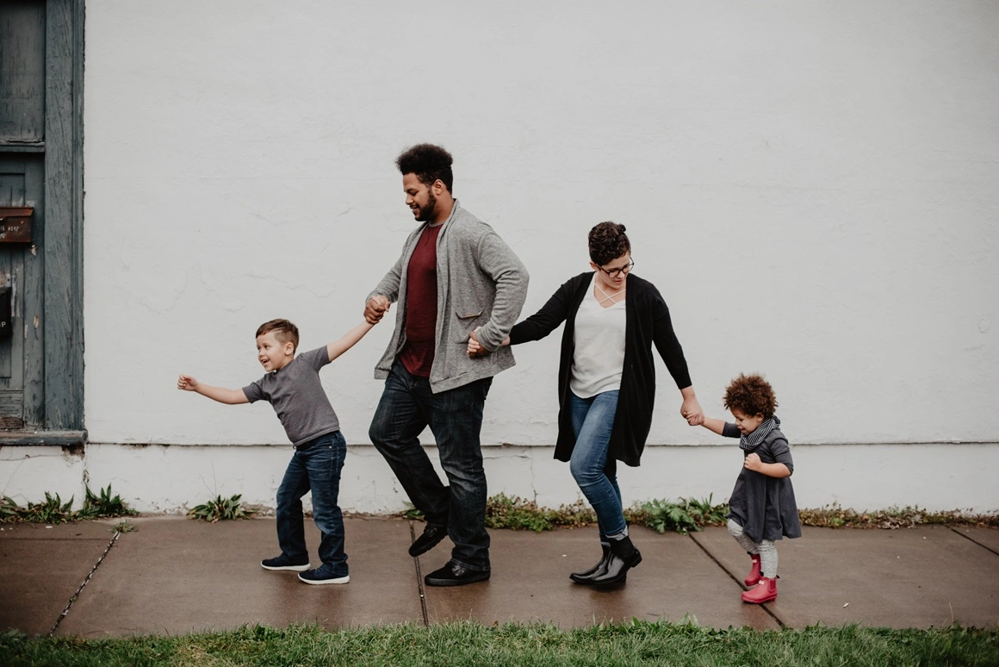

Si preguntamos a la mayoría de los padres qué es lo que desean para sus hijos, probablemente todos contestarán su felicidad, porque la realidad es que lo que más anhelamos es que nuestros hijos vivan en alegría y paz. Y, ¿cuál es el secreto para que nuestros hijos vivan felices? La principal clave es que, sobre todo nosotros, los adultos, **estemos en paz.**  

---

### Educar y cuidar a nuestros hijos, el mayor reto en la crianza

Carl Gustavo Jung decía que si hay algo que deseamos cambiar en el niño, debemos preguntarnos si en realidad es algo que haríamos mejor en cambiar primero en nosotros mismos. Muchas veces culpamos a nuestros pequeños de sus errores y acciones, pero también es importante poner el foco en nosotros como padres.

Muchas veces queremos poner límites a nuestros hijos, pero nosotros no sabemos ponerlos, queremos que gestionen sus emociones, cuando nosotros no sabemos hacerlo, queremos que aprendan a respetarse y a respetarnos, cuando somos nosotros que no nos respetamos, queremos que estén en calma y nosotros no sabemos calmarnos y así podría continuar con una larga lista de incongruencias…  

Nos empeñamos en pensar que somos nosotros los adultos los que debemos corregir o educar a nuestros niños, pero no podemos olvidar que nuestros hijos también nos enseñan sobre la vida y que en el viaje a la maternidad o paternidad aprendemos muchas cosas.

### Observar y aprender de nuestros pequeños

Los niñ@s viven el presente sin juicio, se ponen contentos con pequeñas cosas, son curiosos por naturaleza, son creativos y se ilusionan...

Y sobre todo, **los niños y niñas no tienen miedo a transitar y a sentir todas las emociones humanas**: tanto la tristeza, el miedo, la ira, la sorpresa, el asco o la vergüenza... las viven y las sienten de forma natural y espontánea. Sin embargo, **los adultos construimos mucha más resistencia** a vivir y a sentir todas esas emociones ya que las bloqueamos y consideramos que sentirlas está mal, por lo que las evitamos a toda costa.

Además, muchas veces los adultos nos empeñamos en apagar esa espontaneidad que llevan dentro y que en realidad anhelamos con todas nuestras fuerzas… ya que muchas veces la hemos perdido por el camino.  

### Errores comunes a la hora de educar a nuestros hijos

¿Qué solemos hacer los padres y madres para intentar que nuestros hijos sean felices pero que no ayuda a que lo consigan? A continuación, algunos ejemplos:

- Insistir y decir una y otra vez las cosas mil veces 
- Proyectar un futuro negativo 
- No confiar en nuestros hijos
- Contagiarles el miedo y las inseguridades 
- Tener una mirada con juicio 
- Excesivo control o por el contrario excesiva permisividad

Desde la **terapia breve estratégica** nos enfocamos en mejorar la crianza a través de pequeñas acciones que ayuden a que la convivencia familiar sea más saludable y positiva. No olvidemos que muchas veces los padres, sin querer, hacemos cosas que no ayudan a nuestros pequeños a conseguir su felicidad.

Por eso es importante fijarse en los pequeños cambios para generar una dinámica diferente y así romper con la dinámica anterior, creando una nueva realidad. **No dudes en contactar con nosotros** si tienes dificultades a la hora de educar a tus hijos o si quieres mejorar la convivencia familiar. En nuestro centro, acompañamos tanto a madres, padres y familias para que consigan vivir en armonía y mejorar su convivencia familiar. 

