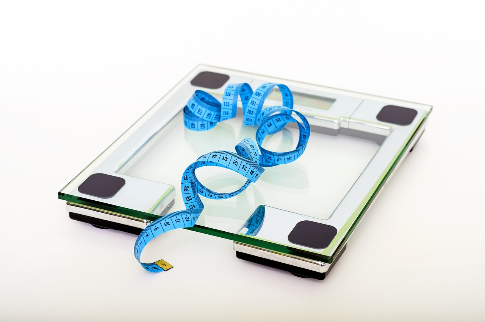

El concepto de "dieta" en griego significa "modo de vida", término que hacía referencia no solo a la alimentación, sino a un conjunto de hábitos que incluían el ejercicio físico, el sueño y las rutinas diarias para mantener una vida saludable. En el siguiente artículo te explicamos las consecuencias negativas de seguir una dieta muy estricta.

---

### El concepto "dieta"

Este concepto ha ido evolucionando hasta llegar a un término más estricto de seguir una alimentación con el objetivo de controlar el peso corporal o mejorar alguna patología.

Esta evolución del término ha sido marcada por la sociedad, el canon de belleza, las nuevas tecnologías, la moda, el marketing alimentario, etc. Todos estos factores desencadenan sentimientos hacia nuestro aspecto físico de desconformidad. Estos sentimientos nos mueven a buscar soluciones, estrategias para mejorar, pero aquí es donde las nuevas tecnologías más daño han hecho. Solemos acabar buscando por internet dietas para adelgazar, dietas para muscular, etc. Y finalmente, acabamos en una página con dietas milagros que no están respaldadas por ningún profesional y no tienen ningún beneficio para la salud.

## ¿Qué es una dieta?

Al principio, este tipo de dietas muy restrictivas, tanto en cantidad como en alimentos, consiguen que haya una pérdida de peso (suele ser el principal objetivo de seguir una dieta tan restrictiva). ¿Y qué sucede cuando llevamos mucho tiempo en esta situación? Llega un punto que esa restricción es insostenible. Como no estamos saciando la parte de placer y nos restringimos muchos alimentos, el antojo y el deseo de comer cada vez va creciendo hasta no poder resistirse a ellos. Finalmente, es posible que perdamos el control. Por lo tanto, haremos una ingesta elevada de esos alimentos que no deberíamos consumir según las reglas (alimentos prohibidos) de la dieta. Todo esto, desencadena en un malestar psicológico ya que es fácil que entremos en un círculo vicioso de atracones con culpa. Sintiendo culpabilidad, descontrol, disminuye la autoestima, posible distorsión de la imagen corporal, frustración, no ser capaz de conseguir lo que quieres, desmotivación, enfado, etc.

## Consecuencias de las dietas muy restrictivas

Una vez hemos abandonado la dieta tan estricta, sucede el famoso efecto rebote. El realizar dietas, una tras otra, con el objetivo de bajar de peso nos puede llevar a una obsesión con la comida y con la imagen corporal. Esto puede suponer tener una mala relación con la comida. A no disfrutarla, a no sentir placer, a sentirse culpable cuando comemos alimentos que consideramos “poco saludables” o que no debemos consumir por su contenido calórico. Todo esto, junto con los mensajes de la industria publicitaria de la imagen corporal y de la alimentación, puede desembocar en una mala relación con la comida y/o un trastorno de la conducta alimentaria.

## Más allá de la dieta

Lo más importante es entender que una persona que quiera perder peso debe ponerse en manos de expertos en nutrición. Además, la manera correcta sería conocer sus hábitos de vida y centrarse en un plan de cambios de diversos factores. No solo no hay que enfocarse en la comida, sino también en el sueño, en la gestión del estrés y la ansiedad, en el trabajo, en si padece enfermedades, en si realiza actividad física, sus emociones, su metabolismo, etc. Poco a poco habrá que ir mejorando ciertos aspectos. De forma indirecta, esta mejora de hábitos mejorará el peso. Pero cuidado, no hay que obsesionarse con el objetivo de la bajada de peso, sino mejorar nuestra salud de forma global.

En tema de alimentación, hay que realizar una educación nutricional y realizar comidas que se basen tanto en saciar nuestra parte del cuerpo que necesita comida para sobrevivir como nuestra parte placentera, la más emocional. La restricción de comida o de calorías no es la forma ideal, ya que nuestro cuerpo tiene sistemas preparados para poder sobrevivir en situaciones no ideales, en este caso en una época de poco consumo de nutrientes.

Si nosotros cada vez le damos menos comida al cuerpo, este activará un sistema de ahorro e irá suprimiendo procesos que en ese momento no encuentra prioritarios, ya que su prioridad es sobrevivir. Por esta misma razón, perderemos músculo, las mujeres pueden llegar a perder la menstruación, enfermamos más rápido, etc. Y todas estas situaciones llevan a que nuestro cuerpo no esté al 100% y por lo tanto podemos llegar a no rendir correctamente en nuestro día a día y enfermar. Al final la comida es nuestra gasolina para poder arrancar el coche, y si tenemos poco no podremos hacer un trayecto muy largo.

## Contacta con nosotros, empieza tu cambio

El concepto dieta va muy alejado de algo sostenible en el tiempo. No se trata de hacer una dieta temporal, se trata de **construir unos hábitos que te duren a largo plazo**, toda la vida. El concepto dieta muchas veces se basa en la restricción y en eliminar el placer y otros muchos alimentos. Esto va a ser difícil de sostener a largo plazo y generará una lucha que no termina nunca y mucha culpabilidad.

En nuestro centro Núria León, gracias a la psiconutrición buscamos romper con la idea “dieta” y nos enfocamos desde un punto flexible, dando paso al placer y a los gustos personales. **Promovemos una relación más consciente, intuitiva con la comida, donde las emociones y la salud mental son aspectos importantes.** Intentamos romper con los conceptos de alimentos “buenos y malos”, con cuerpo perfecto, alimentación perfecta, etc. Este enfoque de la psiconutrición, además de mejorar la relación con la comida, nos ayuda a disfrutar del placer comiendo, de las relaciones sociales, de nuestro cuerpo, mejorar la calidad de vida, mejorar el rendimiento tanto físico como mental día a día, mejorar la calidad del sueño, entre otros. No dudes en contactar con nosotros y empezar tu proceso de cambio.
