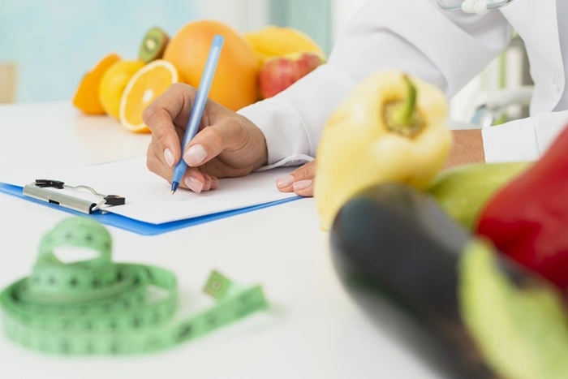

La psiconutrición es una disciplina cada vez más conocida que integra y relaciona los conocimientos de la psicología con los conocimientos de la nutrición. Es muy importante relacionar ambos estudios ya que nuestra relación con la comida puede tener un componente emocional.

---

## Hambre emocional y hambre fisiológica

La psiconutrición estudia y conoce la diferencia entre el hambre emocional y el hambre fisiológica. El hambre fisiológica es cuando nos alimentamos para cubrir nuestras necesidades fisiológicas y de nuestro cuerpo, es decir, cuando tenemos una sensación real de hambre guiada por las hormonas que producen el apetito y la saciedad.

En cambio, el hambre emocional es cuando nos alimentamos para cubrir necesidades emocionales y para sentirnos mejor anímicamente. Por este motivo, los psicólogos somos especialistas también en la conducta alimentaria, ya que podemos abordar este problema tratando primero el estado emocional y psicológico para poder entender mejor esa relación alimentaria. Muchas veces, estamos tristes o ansiosos y sentimos un deseo inmediato de comer algo dulce, ya que de alguna manera nos ofrece alivio y consuelo. Buscar en la comida obtener sensaciones agradables es algo que aparentemente no debería de ser dañino, pero si siempre nos alimentamos para cubrir nuestras necesidades emocionales puede aparecer el sentimiento de culpa después. Y es así cuando entramos en una dinámica dañina en la que comemos porque nos sentimos mal, y nos sentimos mal porque hemos comido. Una vez estamos en esta dinámica autodestructiva es muy difícil salir de ella sin ayuda de un profesional.

## Desajustes alimentarios y la relación con las emociones

Muchos de los problemas de la dinámica alimentaria se originan por una mala gestión de emociones. Cuando nos sentimos mal y acudimos a la comida para sentir placer, cuando comemos para dejar de sentir dolor, para evadirnos, para encontrar consuelo… es cuando puede empezar a haber un desajuste alimenticio. Nuestras emociones además tienen un gran poder a la hora de elegir los alimentos, no es casualidad que nos llamen más un tipo de alimentos que otros. Por eso, es necesario aceptar que lo que comemos influye en nuestras emociones y nuestras emociones influyen en lo que comemos. Todas las emociones son básicas y adaptativas, en vez de querer evitarlas con la comida es importante acudir a un profesional para poder entenderlas y manejarlas mejor.

## Comer con ansiedad y perder el control

Cuando comemos con ansiedad es importante que hagamos un trabajo de introspección ya que puede ser un indicador de que hace mucho tiempo que no escuchamos nuestras necesidades. Utilizar la comida como mecanismo para aliviar nuestra ansiedad puede ser una estrategia dañina que a la larga nos va a traer problemas. La sensación de perder el control es algo que nos daña la autoestima y que si no se mejora puede conllevar problemas graves. Por este motivo, cuando en terapia detectamos un problema en la dinámica alimentaria es importante hacer siempre un trabajo conjuntamente con un psicólogo especialista y con un nutricionista con formación en TCA para poder así mejorar esa relación alimentaria.
