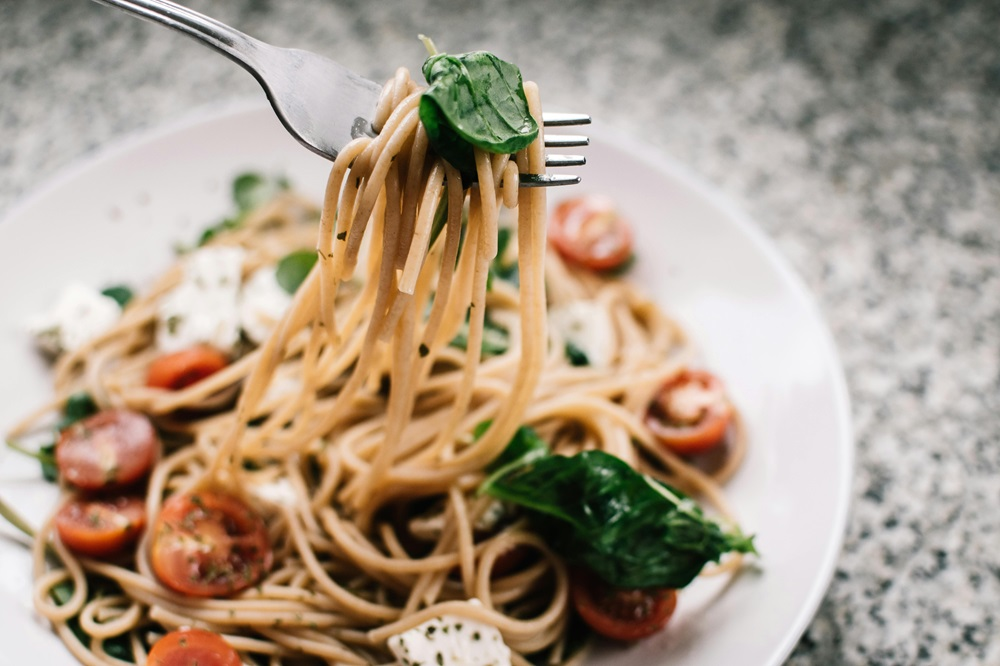

Uno de los primeros pasos para poder reconectar con nuestras sensaciones de hambre y saciedad y disfrutar de las comidas, es conocer los diferentes tipos de hambre para poder identificarlos en cada situación. En el siguiente artículo te explicamos los 9 tipos de hambre que existen.

---

### La importancia de una alimentación consciente

Si podemos reconocer el tipo de hambre además de conectar con nuestras señales y sensaciones, podremos conectar con nuestras emociones y con el placer que puede suponer alimentarnos. Este placer también lo tenemos que saciar y experimentar como otros, y no debemos prohibirnos a ello. Ya que si no hacemos caso a nuestras señales, acabaremos a realizando conductas no apropiadas creando una mala relación alimentaria.

## Conoce los distintos tipos de hambre fisiológica

Según la teoría de Jan Chozen encontramos 9 tipos de hambres. Los diferentes tipos de hambres podemos agruparlos en dos grandes grupos: fisiológica y no fisiológica. Empezaremos por la primera.

Cuando hablamos de **hambre fisiológica** hablamos de cuando nuestro cuerpo necesita nutrientes para poder seguir viviendo y lo manifiesta a partir de señales como rugido del estómago, salivación, mareos, etc. En el caso que tengamos mucha hambre, cualquier tipo de alimento nos saciará. Además, es un tipo de hambre que si la ignoramos y no consumimos ningún alimento, esta irá aumentando con el tiempo y a su vez los signos que la acompañan.

Dentro de este grupo podemos diferenciar entre:

- **Hambre de estómago**: este tipo de hambre nos ayudará sobre todo a saber si tenemos hambre o no según si notamos un vacío en el estomago que puede generarnos también dolor de estómago y por lo tanto nos está indicando que tenemos que comer...

- **Hambre celular:** este tipo de hambre es mucho más complicado de identificar, ya que podemos confundirlo con hambre no fisiológica. Es cuando nuestro organismo nos produce un antojo hacia ciertos alimentos porque contienen algún tipo de nutriente que nuestro cuerpo nota que le falta. Un ejemplo claro sería: en mujeres embarazadas muchas veces tienen antojos de ciertos alimentos porque necesitan algún nutriente que contienen. Podría ser el caso del antojo del queso, ya que nuestro cuerpo necesita el calcio que contienen los lácteos.

## Los tipos de hambre no fisiológica

A diferencia del hambre fisiológica, el **hambre no fisiológica** sucede como consecuencia de estímulos del medio ambiente y por lo tanto no hay una necesidad fisiológica por parte del organismo de consumir alimento. Lo podemos identificar ya que suele estar más asociado al antojo de alimentos más concretos, es un tipo de hambre que no aumenta de intensidad con el tiempo, sucede de repente y no hay signos de rugido del estómago.

Dentro de este tipo de hambre, podemos encontrar:

- **Hambre olfativa:** sucede cuando olemos algún tipo de alimento cuando vamos por la calle, o bien si tenemos a alguien al lado comiendo algún alimento y de golpe nos apetece comernos ese alimento en concreto. Está impulsado por el olor agradable del alimento. Sería un ejemplo cuando pasamos al lado de una panadería y huele a pan y nos entran ganas de poder comer un trozo.

- **Hambre visual**: sucede cuando vemos un alimento o plato con muy buen aspecto y de repente nos apetece. Sería el caso de cuando vemos videos o programas de cocina y nos da placer verlo y por lo tanto promueve este tipo de hambre que nos hace temer antojo de ese plato.

- **Hambre auditiva:** sucede cuando escuchamos el crujido de algún alimento y lo asociamos con que estará bueno y será placentero. Suele suceder cuando alguien de nuestro alrededor está comiendo por ejemplo patatas chips o galletas que crujen.

- **Hambre de tacto:** este hambre está más relacionado con el tacto de las yemas de los dedos. Como sabemos, es una parte del cuerpo super sensible y con ellas podemos averiguar que tipo de alimentos estamos tocando sin poder verlo. El tacto que tenga el alimento y la temperatura nos puede producir una sensación de placer mayor y por lo tanto querer consumir ese alimento. Un ejemplo sería cuando cojemos algún alimento y está frío y no nos gusta, o bien un melocotón con su piel aterciopelada.

- **Hambre de boca**: muchas veces cuando probamos un alimento nuevo, una de las partes más importantes para que nos guste es la sensación que nos produce cuando lo introducimos en la boca. Cuando el alimento entra en contacto con nuestra lengua podemos percibir su textura, temperatura, además del sabor. Según el sabor, también producirá un aumento de la salivación o no que determinará la experiencia que tengamos con ese alimento.

- **Hambre emocional o de corazón**: esta hambre es la que solemos identificar más rápidamente, ya que es la que está asociada con las emociones. Solemos tener alimentos que nos apetecen más y que nos permitimos aquellos días que estamos tristes o cansados. Y por el contrario, en sociedad solemos consumir ciertos alimentos cuando estamos de celebración.

- **Hambre mental o de información**: es un tipo de hambre que relaciona experiencias pasadas con alimentos y cuando vemos, olemos o escuchamos ese alimento nos recuerda de forma inconsciente ese recuerdo y nos reconforta.

## Alimentarnos de forma consciente es autocuidarnos

Todas las hambres son totalmente normales y hay que respetarlas y saciarlas. Pero es importante tenerlas presentes para poder disfrutar del placer de la comida teniendo en cuenta nuestras señales de hambre-saciedad y una alimentación consciente. Cuando comemos de forma consciente y porque nos apetece, nos ayudará a disfrutar mucho más de esa comida.

Alimentarnos es un placer igual que otro y nuestro organismo responde de la misma manera secretando hormonas de la felicidad, y es importante aprovecharlo.

En nuestro centro podemos ayudarte a tener una alimentación más saludable y equilibrada, trabajamos de forma conjunta con la terapia psicológica para que puedas tener una relación con la comida positiva. Contamos con nutricionistas y psicólogos especializados, así que no dudes en contactar con nosotros.
