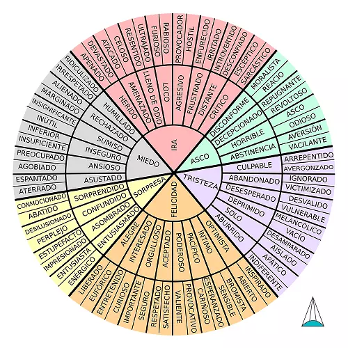

Hoy quiero dedicar este artículo y esta reflexión al maravilloso cuento que Jorge Bucay nos regala en su libro “Cuentos para pensar”. A continuación lo podéis leer:

---

## Cuento: La tristeza y la furia

*En un reino encantado donde los hombres nunca pueden llegar, o quizás donde los hombres transitan eternamente sin darse cuenta...
En un reino mágico, donde las cosas no tangibles, se vuelven concretas...
Había una vez... un estanque maravilloso.
Era una laguna de agua cristalina y pura donde nadaban peces de todos los colores existentes y donde todas las tonalidades del verde se reflejaban permanentemente...*

*Hasta ese estanque mágico y transparente se acercaron a bañarse haciéndose mutua compañía, la tristeza y la furia.
Las dos se quitaron sus vestimentas y desnudas las dos entraron al estanque.
La furia, apurada (como siempre está la furia), urgida -sin saber por qué- se bañó rápidamente y más rápidamente aun, salió del agua...
Pero la furia es ciega, o por lo menos no distingue claramente la realidad, así que, desnuda y apurada, se puso, al salir, la primera ropa que encontró...
Y sucedió que esa ropa no era la suya, sino la de la tristeza...
Y así vestida de tristeza, la furia se fue.*

*Muy calma, y muy serena, dispuesta como siempre a quedarse en el lugar donde está, la tristeza terminó su baño y sin ningún apuro (o mejor dicho, sin conciencia del paso del tiempo), con pereza y lentamente, salió del estanque.*

*En la orilla se encontró con que su ropa ya no estaba.
Como todos sabemos, si hay algo que a la tristeza no le gusta es quedar al desnudo, así que se puso la única ropa que había junto al estanque, la ropa de la furia.*

*Cuentan que desde entonces, muchas veces uno se encuentra con la furia, ciega, cruel, terrible y enfadada, pero si nos damos el tiempo de mirar bien, encontramos que esta furia que vemos es sólo un disfraz, y que detrás del disfraz de la furia, en realidad... está escondida la tristeza.*

## ¿Cómo gestionar la tristeza o la ira? 

Fue una misma paciente la que me habló por primera vez sobre esta historia y me quedé fascinada. Desde que descubrí los libros de este autor, mi forma de entender la psicología y la terapia ha cambiado. Desde que empecé a ejercer como psicóloga he podido observar y comprender la complejidad del ser humano a la hora de sentir sus emociones. 

Si bien es cierto que existen emociones con matices muy diferentes, muchas veces una emoción puede ir con otra de la mano, o incluso lo que aparentemente parece una cosa, puede ser otra. Os adjunto este vocabulario emocional para que empecéis a identificar mejor los distintos matices en aquello que sentís. No siempre las emociones son las mismas, habrá veces en las que sentiremos rabia, en otros momentos frustración y a veces hostilidad. Todas estas emociones forman parte de la ira, aunque no todas significan lo mismo.

*Rueda de emociones*

Si hablamos de tristeza y furia, que serían las dos emociones generales del centro de la rueda, podemos entender con este cuento que son realmente emociones primas hermanas. Muchas veces la furia contenida puede acabar desarrollando una tristeza, y puede que una tristeza profunda lo que nos quiere transmitir es que ha habido muchas furias contenidas. 

## Gestionar las emociones de forma saludable

Hay veces que uno acumula y acumula emociones de rabia y enfado, pero si esta contención la mantenemos a largo plazo, acabará convirtiendose en una depresión y una tristeza profunda. **La identificación y la validación** son dos de los primeros pasos para empezar a gestionar mejor lo que sentimos. Aun así no sería suficiente para poder gestionarlas de forma saludable. Conocer la función de cada emoción es necesario para conocernos a nosostros mismos. 

Pedir la ayuda de un **psicólogo especializado** es lo mejor para que pueda ayudar a identificar, validar y transitar junt@s las emociones desde la aceptación y el no juicio. Las emociones no son malas en sí, todas tienen su función y son adaptativas, nos ofrecen un mensaje que hay que escuchar para poder resolverlo. 

