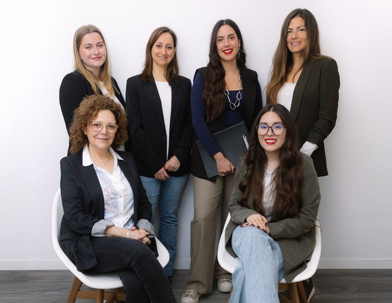

import { Image } from "astro:assets"
import GoIcon from "~/icons/go.astro"
import "./equipo.css"
import { authors } from '~/content/authors/authors'

En nuestro centro estamos en la búsqueda constante de mejorar y crecer, por eso actualmente hemos ampliado el equipo. Trabajamos conjuntamente con los mejores profesionales del sector y supervisamos casos, para asegurarnos de que el servicio que ofrecemos sea el mejor para cada persona.

El equipo es multidisciplinar, contamos con especialistas en psicología sanitaria, acompañamiento emocional y psiconutrición. Cada caso es diferente y por ello trabajamos en conjunto para poder ofrecer un servicio personalizado.

<Image class="img" alt="Núria" src={authors.nuria.image} height="450" />
<h2 class="member__name" id="nuria">Núria</h2>

**Fundadora y Directora del centro. Psicóloga Sanitaria Colegiada 26792.** Especialista con mucha experiencia en todo tipo de problemas psicológicos graves: fobias, TOCS, ansiedad, hipocondría, agorafobia, TCA, depresión, autolesiones, problemas de ira, toma de decisiones... 

Mi metodología combina la terapia estratégica y la terapia cognitiva conductual, aunque también utilizo multitud de herramientas y recursos psicológicos. Soy una apasionada de mi trabajo y  puedo ayudarte sea cual sea tu situación vital. 

**Psicóloga Sanitaria de adultos, terapia de parejas, terapia familiar y adolescentes**.

Puedo ayudarte en todo tipo de problema psicológico o emocional de forma eficaz: problemas de autoestima, duelos, rupturas de pareja, conflictos en pareja, toma de decisiones, acoso laboral, problemas familiares, miedos, estrés post traumático, gestión de emociones, duelos, conducta alimentaria, autolesiones...

- **Máster en Terapia Breve y Comunicación Estratégica** Modelo de intervención de Giorgio Nardone en Institut Gestalt
- **Máster de Psicología General Sanitaria** en UCAV
- **Posgrado en Psicopatología clínica** en la Universitat de Barcelona
- **Máster Psicología Infantil y Juvenil: Técnicas y Estrategias de Intervención** en UOC
- **Máster en Estrategia y Gestión de Marca** en la Barcelona School of Management Pompeu Fabra
- **Grado de Psicología** en la Universitat de Barcelona

<a href="/sobre-mi/" class="member__navigation navigation">
Más sobre mí <GoIcon />
</a>

<Image class="img" alt="Helena" src={authors.helena.image} height="450" />
<h2 class="member__name" id="helena">Helena</h2>

**Psicóloga Sanitaria Colegiada**. Especialista en terapia de pareja y familiar, ansiedad, depresión, y en reprocesamiento del trauma en adultos.

**Psicóloga sanitaria especialista en adultos, familias y parejas**.

Helena acompaña a las personas con un enfoque sistémico: la comprensión del rol que realizan dentro de sus sistemas (familia, trabajo, entorno). También está enfocada en la psicoterapia y reprocesamiento del trauma en adultos, y divorcios conflictivos.

Helena puede ayudarte en: problemas de pareja, problemas familares, infidelidad, conflictos, rups, dependencia emocional, trauma, problemas de apego, crianza, maternidad, autoestima, ansiedad, depresión, estrés, bullying, burnout...

- **Máster en Psicología General Sanitaria** en UNIR
- **Formación en intervenciones sistémicas y terapia familiar** en Institut Sistèmic de Barcelona
- **Psicopatología clínica e intervención comunitaria. Asociación Española de Neuropsiquiatría** en AEN
- **Mediación terapéutica en procesos de separación y/o divorcios conflictivos** en Institut Sistèmic de Barcelona
- **Psicoterapia y reprocesamiento del trauma** en Institut Alecés
- **Grado en Sociología** en la Universitat de Barcelona
- **Grado en Psicología** en UNED

<Image class="img" alt="Ariadna" src={authors.ariadna.image} height="450" />
<h2 class="member__name" id="ariadna">Ariadna</h2>

**Psicóloga Sanitaria y Sexóloga Colegiada.** Especialista en terapia de pareja, sexualidad, ansiedad, depresión e imagen corporal. Psicóloga integradora, combina diferentes corrientes y herramientas para adaptarse a cada caso.

**Psicóloga Sanitaria de adultos y parejas.**

Tiene amplia experiencia como psicóloga sanitaria de adultos y parejas. Su enfoque terapéutico es sistémico y cognitivo conductual. Sigue en constante formación y supervisión clínica.

Ariadna puede ayudarte en: sexualidad, trauma, acompañamiento emocional en reproducción asistida, abortos, psicología perinatal, suicidio, autolesiones, apego, duelos, ansiedad, depresión, dificultades sexuales, problemas de pareja, crisis de identidad y género, psicología LGTBIQ+, ...

- **Formación en auxiliar, acompañar y prevenir a personas con ideación suicida** en Escuela Universitaria de Psicoterapia Integradora
- **Formación en tratamiento de apego y trauma desde una visión integradora** en Escuela Universitaria de Psicoterapia Integradora
- **Máster en Sexología y Terapia de Pareja** en la Universidad a Distancia de Madrid
- **Máster en Psicología General Sanitaria** en la Universitat Ramón Llull
- **Grado en Psicología** en la Universitat Ramón Llull

<Image class="img" alt="Cristina" src={authors.cristina.image} height="450" />
<h2 class="member__name" id="cristina">Cristina</h2>

**Psicóloga Sanitaria Colegiada.** Especialista en terapia de adultos, familiar e infantojuvenil. Psicóloga integradora, combina diferentes corrientes y herramientas para adaptarse a la realidad de cada persona.

**Psicóloga Sanitaria de adultos, familias y adolescentes**.

Ha trabajado en varios centros como psicóloga sanitaria con adolescentes y adultos de diferentes franjas de edad. Su enfoque terapéutico es sistémico y cognitivo conductual. Sigue en constante formación y supervisión clínica.

Cristina puede ayudarte en: ansiedad, depresión, crianza, maternidad, apego, psicología perinatal, abortos, duelos, fobias, miedos, TDAH, autismo, problemas de comportamiento adolescente...

- **Monográfico de terapia de pareja** en Centro Dendros
- **Posgrado en Terapia Integradora Individual** en Centro Dendros
- **Posgrado en Trastornos emocionales y psicopatología legal infantojuvenil** en Universidad Autónoma de Barcelona
- **Posgrado Enfermedades Crónicas y Trastornos del comportamiento InfantoJuvenil** en Universidad Autónoma de Barcelona
- **Formación en la Unidad de Terapia de Conducta** en la Universidad Autónoma de Barcelona
- **Grado en Psicología** en la Universidad Barcelona

<Image class="img" alt="Sonia" src={authors.sonia.image} height="450" />
<h2 class="member__name" id="sonia">Sonia</h2>

**Psicóloga Sanitaria y Sexóloga Colegiada**. Especialista en ansiedad, depresión, sexualidad y adicciones comportamentales (juego patológico, ludopatía, pantallas o internet, adicción al sexo, al trabajo, apuestas, videojuegos, compras compulsivas, dependencia emocional, ...).

**Atiende a jóvenes y adultos.**

Psicóloga integradora, combina técnicas cognitivo conductual, humanistas y técnicas de terapias de tercera generación como Terapia de Aceptación y Compromiso y terapia Dialéctico-Conductual.

Sonia te puede ayudar en: adicciones, ansiedad, ataques de pánico, agorafobia, miedos, regulación emocional, depresión, duelo, rupturas, dependencia emocional, apego ansioso o inseguro, dificultades sexuales, autoestima, psicología LGTBI+ y crecimiento personal.

- **Máster Psicología General Sanitaria** en la Universitat Blanquerna Ramon Llull
- **Máster en Sexología Clínica y Terapia de pareja** en la Universistat de Girona
- **Posgrado en Adicciones Comportamentales y Manipulación Psicológica** en la Universitat de Barcelona
- **Máster en Psicoterapia integradora** impartido por Ana Gómez
- **Formación en Psicología Afirmativa LGTBIQ+ y sexualidades no normativas**
- **Curso en Masculinidades y Violencia de Género**
- **Grado en Psicología** en la Universitat de Barcelona

<Image class="img" alt="Teresa" src={authors.teresa.image} height="450" />
<h2 class="member__name" id="teresa">Teresa</h2>

**Psicóloga Sanitaria Colegiada.** Tiene amplia experiencia en terapia para adultos, mediación familiar, terapia de parejas y adolescentes.

**Psicóloga General Sanitaria de adultos, parejas, familias y adolescentes.**

Su enfoque terapéutico es cognitivo conductual, aunque también utiliza una metodología integradora combinando técnicas humanistas y del psicoanálisis. Utiliza técnicas basadas en la evidencia empírica, basándose en estudios e investigaciones recientes. Sigue en constante formación y supervisión clínica.

Teresa puede ayudarte en cualquier situación de: ansiedad, depresión, autoestima, problemas de orientación laboral, coaching laboral, mediación familiar, crisis de parejas, problemas familiares, rupturas, infidelidad, celos, compulsiones, obsesiones y duelos.

- **Máster en Psicología General Sanitaria** en UDIMA
- **Posgrado en Psicoanálisis** en la Universitat de Girona
- **Posgrado en Recursos Humanos** en Universitat Ramón Llull
- **Formación en violencia de género** a la Fundació Pere Tarrés
- **Curso de Resolución de Conflictos y Gestión del Estrés** en la Fundación Paco Puerto
- **Curso de coaching sistémico** en Foment Formació
- **Curso de Llenguatge sexiste inclusiu** en Ajuntament de Sabadell
- **Licenciatura de Psicología** en la Universitat de Barcelona

<Image class="img" alt="Iris" src={authors.iris.image} height="450" />
<h2 class="member__name" id="iris">Iris</h2>

**Nutricionista Colegiada.** Especialista en psiconutrición y nutrición clínica. Realiza un servicio de nutrición complementario a la terapia psicológica. Sigue en constante formación y supervisión clínica.

**Nutricionista de Trastornos de Conducta Alimentaria (TCA)**.

En el centro realizamos un abordaje psicológico y nutricional en conjunto para tratar los casos de forma más eficaz.

Iris puede ayudarte si tienes una mala relación alimentaria y también si te identificas con: restricción alimentaria, compensaciones, atracones, anorexia, bulímia, TCA, autoestima corporal, miedo a engordar, miedo a comer algunos alimentos, y en general si quieres mejorar tu relación con la comida.

- **Experta en Trastornos de la Conducta Alimentaria** en Norte Salud Psiconutrición
- **Curso de Nutrición y Dietética aplicada en personas con diabetes** en Codinucat y SJD
- **Máster Oficial en Nutrición Clínica Universidad Europea de Madrid** (2022-2023)
- **Curso Coaching Nutricional Institute Nutritional Coaching** (2022)
- **Grado en Nutrición Humana y Dietética en Universitat de Barcelona** (2018-2022)

