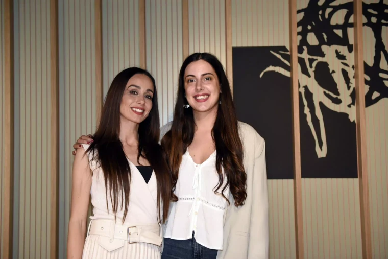
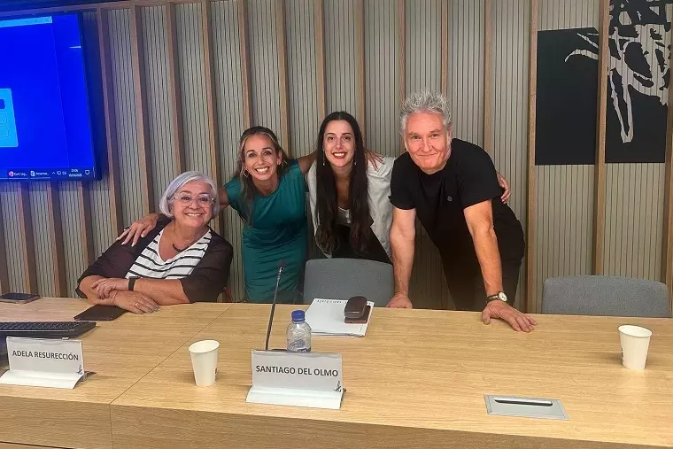

import { Picture } from "astro:assets"

Soy Núria León y vivo en Barcelona. Soy psicóloga por la Universitat de Barcelona y mi número de colegiada es el 26792 por el Col·legi Oficial de Psicòlegs de Catalunya. Pertenezco a la sección de Psicología Clínica de la Salud y Psicoterapia Sanitaria.

Mi trayectoria profesional está enfocada en ayudar a personas a superar dificultades y a vivir mejor. Tengo muchos años de experiencia con todo tipo de casos y con todo tipo de edades, aunque mi especialidad son los adultos y los jóvenes. He trabajado tanto en consulta privada por mi cuenta como en varios centros médicos reconocidos. 

Desde 2019 empecé a trabajar por mi cuenta y es cuando me di cuenta de la **gran pasión que siento por la mente humana y el sufrimiento psicológico**. Por ese motivo, no he parado desde entonces y he tenido una gran evolución como psicóloga. Empecé trabajando sola y actualmente llevo mi propio centro y somos 6 profesionales. Sigo siendo una apasionada de mi trabajo y por esas razones me siento enormemente afortunada de estar donde estoy. Actualmente sigo formándome para poder ofrecer siempre el mejor servicio.

<Picture alt="Núria León" src={import("nurialeon_002.jpg")} width="700" />

Ayudo a muchas personas en situaciones complicadas (vivencia de duelos, inseguridad, separaciones, enfermedades o diagnósticos clínicos, impulsos de agresividad, agorafobia, hipocondría, problemas de autoestima y gestión emocional, problemas familiares, relaciones amorosas difíciles, toma de decisiones importantes, ansiedad, depresión, estrés...). También acompaño a personas que simplemente quieren mejorar algún aspecto de su vida y ser más felices.

Mi formación y mi metodología es principalmente breve estratégica aunque combino diferentes metodología. Ya son centenares de personas las que han pasado por mi consulta y han resuelto sus problemas de forma eficaz, [puedes leer todas las reseñas aquí](https://g.page/r/Cbk285IdPtR5EAg).

**Lo que más me gusta y en lo que más me diferencio, es en mi entrega absoluta hacia las personas que acompaño**. Estoy constantemente buscando dar lo mejor de mí y **mejorando mis técnicas de intervención**. Utilizo un diálogo estratégico y comunicativo persuasivo, necesario para generar en cada persona el cambio que necesita. Me centro no tanto en el por qué de los problemas, sino en cómo estos se mantienen estos en el tiempo. De esta manera 
*abordo de forma eficaz desmontando y desestructurando la dinámica del problema, sea cual sea.*

## ¿Cuál es mi formación más relevante?
- **Máster de Psicología General Sanitaria** en Universidad Católica de Ávila
- **Máster en Terapia Breve y Comunicación Estrategica en Institut Gestalt**
- **Máster Psicología Infantil y Juvenil**: Técnicas y Estrategias de Intervención en la UOC (cursando)
- **Postgrado en Psicopatología clínica** por la Universitat de Barcelona con un 9,5 de nota final
- **Máster en Estrategia y Gestión de marca** por la Barcelona School of Management de la Universitat Pompeu Fabra con un 8,2 de nota final
- **Grado de Psicología** en la Universitat de Barcelona

## Otra formación complementaria

- **Los Trastornos Alimentarios y su Intervención Eficaz desde la Terapia Breve Estratégica** (2023)
- **Psicoterapia integradora para el tratamiento de la ansiedad** (2022)
- **Lateralidad y sus repercusiones en el aprendizaje** (2022)
- **Servicios Sociales en el Ayuntamiento de Barcelona**: Curso del Colegio de Psicólogos de Catalunya (2021)
- **Curso de Estimulación Cognitiva** de Fundació Pere Farrés (2020)
- **Curso de Tratamiento psicológico en el dolor crónico** por el Colegio de Psicólogos de Madrid (2020)
- **Formación oficial en Mindfulness para la Reducción del Estrés y la Salud** (2019)

## Colaboraciones y Experiencia

Durante la pandemia del Covid-19 tuve la oportunidad de trabajar en la multinacional de salud **Teladoc Health** y definir un proyecto de psicología para algunas de las mutuas de salud más importantes a nivel nacional, incluída AXA. Durante todo el proyecto, fui la **responsable de la definición estratégica del servicio pionero de orientación psicológica y emocional** . Asimismo, estuve trabajando como _psicóloga_ en el proyecto y pude ayudar a todas las personas que necesitaban apoyo psicológico durante el momento de la pandemia.

También he trabajado en un _centro especializado en psicomotricidad y lateralidad_ con familias, niños y adolescentes con dificultades de aprendizaje, TDAH, autismo y problemas de lateralidad cruzada. A lo largo de esos años, no solo pude trabajar con niños y adolescentes sino también con familias que necesitaban pautas y asesoramiento psicológico.

Paralelamente, siempre estoy en constante supervisión clínica y he estado durante meses colaborando en el **Centro de Júlia Pascual**, un centro de referencia de Barcelona de la Terapia Breve Estratégica. Durante mi colaboración pude asistir a las sesiones de psicoterapia supervisada por la misma **Júlia Pascual**, embajadora de la Terapia Breve Estratégica en España, quien me ha formado y supervisado sobre esta metología terapéutica.

_Júlia Pascual y Núria León en el Colegio de Psicólogos de Catalunya_

Durante todo el 2023, realicé un **Máster de Comunicación y Terapia Breve Estratégica** en el Institut Gestalt con los profesores **Adela Resurrección** y **Santiago del Olmo**, pioneros también en España de la Terapia Breve Estratégica y formados en Arezzo por **Giorgio Nardone**.

_Adela Resurrección, Júlia Pascual, Santiago del Olmo y Núria León en una conferencia sobre terapia breve estratégica en el Colegio de Psicólogos de Catalunya_

El modelo estratégico de intervención intenta entender el cómo funciona el problema del paciente, no tanto en la causa si no en el cómo, con el objetivo de plantear nuevas perspectivas. Este tipo de tratamiento es muy eficaz en trastornos de alimentación, fobias, ataques de pánico, hipocondría, depresión, trastornos obsesivos compulsivos y problemas psicosomáticos.

## Medios de Comunicación y Redes Sociales

Puedes seguirme en todas mis redes sociales en las que vas a encontrar todo el contenido, entrevistas y reflexiones que voy publicando. También he realizado entrevistas en diferentes medios, como por ejemplo:

Puedes ver mi [Linkedin](https://www.linkedin.com/in/nurialeonsallent/), donde tengo toda mi trayectoria profesional con más detalle.

- [Mis publicaciones en Instagram](https://www.instagram.com/nurialeonpsicologa/#) y [TikTok](https://www.tiktok.com/@nurialeonpsicologa)
- [Artículo en una revista local sobre el efecto del covid19 en la salud mental](https://www.latorredebarcelona.com/la-nevera/com-ha-afectat-la-covid-19-a-la-salut-mental/)
- [PODCAST Entrevista que me hicieron en Youtube sobre Redes Sociales ](https://youtu.be/7fph1wZDpTA?si=c8EDSdt3yneeR0Wh&t=1076)
- [Entrevista que realicé sobre POLIAMOR Y RELACIONES ABIERTAS](https://www.youtube.com/watch?v=MTkW2ZCv550&t=260s)

